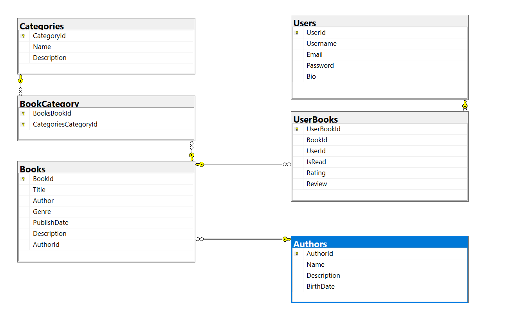

# bookapp
This application demonstrates usage of basic languages used for frontend development - css/boostrap/javascript

## Presentation I (week 4 / 12.03): 

Web Application Front-End & Application Functional Requirements (complete list of functionalities)

# Functional Requirements:

1.  Allow users to register accounts.
2.  Authentication procedure.
3.  Implement a book catalog accesible via Browse page
4.  This view should contain a search functionality based on genre/name
5.  Create a book details view with the possibility to add it in user's wishlist.
6.  Display book information including summaries.
7.  Wishlist view should contain a button that marks the book as read.
8.  Implement add book functionality
9.  Creation of a profile view that allows user to customize his username/bio and possibilty to add an account picture.

# Other Requirements:

1. Intuitive interface
2. Ensure easy navigation for users to explore books/genres or authors.
3. Create a logo for the application and add it on Home page.
4. Each view should have a different background picture

## Presentation II (week 7 / 03.04): 

- database design schema comprising at least 6 tables. The database schema/design can be created using any tool (e.g. MySQL Workbench). However, for an easy visualization it is recommended to export it as an image
- implementation of the database in the web application using code-first approach
- set up the connection between the web application and the database. Make sure the database is generated and the connection string is correctly defined
- add a test MVC Controller with views, using Entity Framework for one of the models

